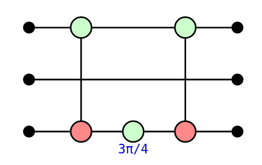
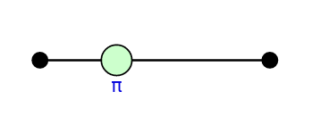
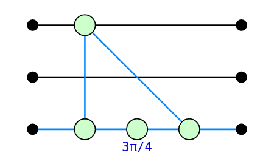

# PyZX

[PyZX](pyzx.readthedocs.io/) is an implementation of the ZX-calculus. It stands apart from the other quantum programming environments presented in these tutorials in that it is not intended to be used to actually program a quantum computer. Rather, it is to be used as an interface to programmatically manipulate the rules of the ZX-calculus. As the name suggests, it is written in, and provided as a package for, the Python programming language. There are other implementations of the ZX-calculus, such as in [Rust](https://github.com/Quantomatic/quizx) or [Julia](https://juliapackages.com/p/zxcalculus), but neither are as feature complete as PyZX. In particular, although the Rust implementation is considerably faster, it lacks many of the features of PyZX. In particular, PyZX includes tools for visualizing and manipulating ZX-diagrams which can be conveniently used inside a Jupyter notebook.

The ZX-calculus and it's applications to quantum computation are the subject of ongoing research, and currently PyZX only implements a rather limited subset of rewrite rules of the ZX-calculus. These rewrite rules have been found to be useful in applications, mostly for the optimisation and compilation of quantum circuits.

# Tutorial

PyZX is made available as a PyPi package, which can then be installed via `pip install pyzx` and imported as usual:

    import pyzx as zx
    
    from fractions import Fraction # Used to described fractional phases

## Circuits & ZX-Diagrams

Quantum circuits are represented in PyZX using the `Circuit` class, whose underlying data consist in a list of gates taken from those defined in PyZX. For instance:

    circ = zx.Circuit(3) # The initialisation argument describes the number of qubits in the circuit 
    
    circ.add_gate("CNOT", 0, 2)
    circ.add_gate("ZPhase", 2, phase=Fraction(3,4))
    circ.add_gate("CNOT", 0, 2)

The gates supported by PyZX are defined in the `pyzx.circuit.gates` submodule, and we refer you there for the auxiliary arguments that must be given for each gate type (or to calling `help(zx.circuit.gates)`).

PyZX provides an interface for importing circuits for several of the other programming languages from these tutorials. In particular, the `Circuit` methods `from_qasm`, `from_quipper` make it possible to import circuits from the OpenQASM 2.0 and Quipper formats respectively. The `load` method tries to detect the correct format for an argument filename then applies the corresponding import method. Lets import one of the circuits from the Qiskit tutorial:

    circ2 = zx.Circuit.from_qasm("""
        OPENQASM 2.0;
        include "qelib1.inc";
        qreg q[4];
        h q[0];
        cx q[0],q[1];
        cx q[3],q[1];
    """)

Note that PyZX does not support the entire OpenQASM 2.0 standard. For instance, quantum measurements cannot be described in PyZX, and therefore will not be correctly imported. Of course, PyZX also provides the corresponding methods for writing a circuit out to these format, in the form of the `to_qasm`, `to_quipper` (and so on) methods.

PyZX also defines functions for randomly generating circuits. Unfortunately, these are not all declared in the submodule `__init__.py` files, so must be imported individually:

    from pyzx.generate import CNOT_HAD_PHASE_circuit
    
    qubits = 3 # number of qubits in the circuit
    depth = 5 # number of gates in the circuit
    
    circ3 = CNOT_HAD_PHASE_circuit(qubits, depth, p_had=0.2, p_t=.3)

ZX-diagrams are represented in PyZX by an instance of the `BaseGraph` class, the underlying data of which consist in a simple graph along with some additional data on vertices. Specifically, the vertices are labelled by (not necessarily contiguous) integrers, and there are four types vertices: Z-spiders, X-spiders, H-boxes, and boundaries (which represent either an input or an output of the diagram). The type of a vertex is given by an integer, whose value is defined in `pyzx.utils.VertexType` by the constants `VertexType.BOUNDARY`, `VertexType.Z`, `VertexType.X`, and `VertexType.H`.

**A note on backends**: In fact, `BaseGraph` is a "shell" class that merely defines the interface that any ZX-diagram class must implement in PyZX. There are a number of different backend implementations provided in the `pyzx.graph` submodule. The current default is `GraphS`, a purely Pythonic implementation of the interface. The `zx.Graph()` function constructs an instance of an implementation of `BaseGraph`, currently `GraphS`.

To construct an empty ZX-diagram, we write:

    diagram = zx.Graph()

We can add vertices to the graph using the `add_vertex` and `add_vertices` methods, which furthermore return the indices of the newly-created vertices:

    diagram.add_vertices(3)

We can then set the type and phase (if necessary) of a vertex as follows:

    for vertex in range(0, 3):
        diagram.set_type(vertex, zx.VertexType.Z)
    diagram.set_phase(0, Fraction(2,3)) # The second argument is a fraction of 2 * pi

We can check the type of a vertex with:

    print(diagram.type(2) == zx.VertexType.Z)

Similarly, we can add edges to the graph using:

    diagram.add_edge((0,1)) # Adds an edge between vertices 0 and 1
    diagram.add_edge((1,2)) # Adds an edge between vertices 1 and 2

However, this isn't really the "standard" way to instantiate a ZX-diagram. It's much more common to obtain one from a quantum circuit of interest, and PyZX of course provides a method to do so. To convert our circuit to a diagram, we write:

    circ_diagram = circ.to_graph()

We can then visualise the diagram with:

    zx.draw(circ_diagram)

An interactive visualisation can be obtained using the PyZX graph editor. The editor can be used to manipulate vertices of the diagram, apply rewrite rules or even arbitrary edits to the diagram:

    zx.editor.edit(circ_diagram)

Click "Save snapshot" to save the result back into `circ_diagram`. Within the PyZX editor, you will note that we can also apply some of the ZX-calculus rewrite rules to our diagram. Let's next see how we can do this programmatically.

## Applying rewrites

The syntax for applying a result is a little complex. Rewrites are applied by calling the `zx.simplify.simp` function, which takes 4 non-optional arguments:

- the diagram `diagram` to apply the rewrites to;
- a string `name`, which simply describes a name to display;
- a function `match`, which finds *non-intersecting* matches in `diagram` of the LHS of the rewrite rule to apply;
- a function `rewrite`, which rewrites each match to the RHS of the rule.

The rewrite rules that were available in the editor all have `match` and `rewrite` functions which are described in the `pyzx.rules` submodule. These each come in a version that finds a single match, and a version that tries to find as many *non-overlapping* matches in the diagram as possible, dubbed "parallel" versions.

Let's apply the spider fusion rule to the following simple diagram:

    circ4 = zx.Circuit(1) # The initialisation argument describes the number of qubits in the circuit 
    
    circ4.add_gate("ZPhase", 0, Fraction(1/2))
    circ4.add_gate("ZPhase", 0, Fraction(1/2))
    
    circ_diagram4 = circ4.to_graph()

    zx.simplify.simp(circ_diagram4, "spider", zx.simplify.match_spider, zx.simplify.spider)

Now, if you peruse the content of `pyzx.simplify` (for intance with `help(zx.simplify)`), you will notice that the set of rewrites defined is very incomplete, and also includes some rather unfamiliar rewrites. This is partly because only rewrites which have proved useful in practice have been implemented, and partly because of the issue of circuit extraction. 

## Extracting circuits from diagrams

It is easy to turn a quantum circuit into a ZX-diagram and apply rewrite rules. However, once these rewrites have been applied it can be very complicated to extract a quantum circuit from the resulting diagram, short of reversing all of the rewrites and returning to the original circuit. In fact, it was [recently proved](https://arxiv.org/abs/2202.09194) that extracting circuits from an arbitrary ZX-diagram (one not necessarily obtained from a circuit in the first place) can be #P-hard, even under the promise that such a circuit exists. 

In order to avoid this difficulty, one carefully applies rewrites to a diagram which are known to preserve some global property of the diagram which guarantees extractability. For example, "causal flow" is a graph-theoretic property originally defined for reasoning about measurement-based quantum computations (MBQC). When applied to ZX-diagram, it guarantees that the ZX-diagram can be interpreted as such an MBQC for which a circuit extraction is known. The problem of finding such rewrite rules is still very much the topic of ongoing research, and goes beyond the remit of these notes.

These rewrite strategies are assembled into simplification strategies for quantum circuits, also defined in `pyzx.simplify`. The main ones are `clifford_simp` and `full_reduce`. Let's apply `clifford_simp` to simplify one of our circuits:

    zx.clifford_simp(circ_diagram)

This is clearly not a circuit, but we can extract a PyZX `Circuit` using:

    simplified_circuit = zx.extract_circuit(circ_diagram)

# Deutsch-Jozsa algorithm

Let's import the (unitary part of) the Deutsch-Jozsa quantum circuit we gave in the OpenQASM and Qiskit tutorials:

    dj_circ = zx.Circuit.from_qasm("""
    OPENQASM 2.0;
    include "qelib1.inc";
    qreg q[4];
    creg c[3];
    h q[0];
    h q[1];
    h q[2];
    x q[3];
    h q[3];
    x q[0];
    x q[2];
    barrier q[0],q[1],q[2],q[3];
    cx q[0],q[3];
    cx q[1],q[3];
    cx q[2],q[3];
    barrier q[0],q[1],q[2],q[3];
    x q[0];
    x q[2];
    h q[0];
    h q[1];
    h q[2];
    barrier q[0],q[1],q[2],q[3];
    measure q[0] -> c[0];
    measure q[1] -> c[1];
    measure q[2] -> c[2];
    """).to_graph()

As announced, `from_qasm` ignores the the classical parts when importing the circuit. We can then appy an optimisation routine, then extract a circuit back out:

    zx.clifford_simp(dj_circ)
    optimisied_circuit = zx.extract_circuit(dj_circ)

Now, it might not be apparent from such a small circuit, but the optimisation ideas underlying `clifford_simp` have proven very effective when the circuits get much larger. It's also worth pointing that this example might be somewhat unnatural: we are optimising not just the circuit for implementing Deutsch-Jozsa, but also the circuit that implements the oracle for the input function `f`.

---

[Back](index.html)
