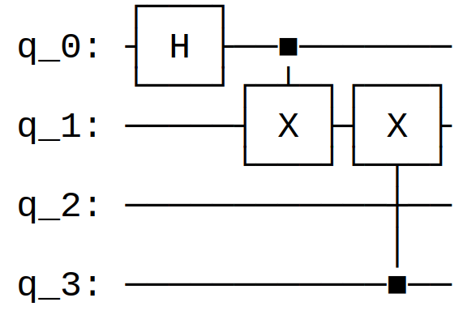
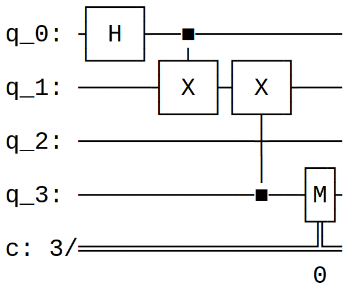
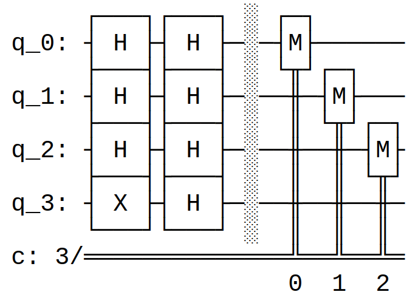

# Qiskit

### Overview

[Qiskit](https://qiskit.org/documentation/index.html) is an open source programming language
developed by IBM and built on top of the Python programming language. It integrates with [OpenQASM](openqasm.html) (with some hopefully temporary friction around OpenQASM versioning). In fact, Qiskit more accurately refers to a family of integrated frameworks for quantum computation. The most important of these are:

* **[Qiskit Terra](https://qiskit.org/documentation/apidoc/terra.html)**, a circuit description language with a Python-like syntax and the foundation of the Qiskit software stack. It also includes tools for the visualisation of circuits and quantum states, and for the optimisation of circuits for specific hardware devices.

* **[Qiskit Aer](https://qiskit.org/documentation/apidoc/aer.html)**, which provides facilities for classically simulating those circuits, along with realistic noise models for those simultations.

Along with classical simulations, Qiskit can also be used to interact with various [quantum hardware providers](https://qiskit.org/documentation/partners/) in the cloud.

### Tutorial

Qiskit is provided as a Pypi package for Python. As a result, its syntax follows the rules of Python. For starters, we import the package as usual:

    import qiskit as qs

The core class for describing a quantum circuit in Qiskit is, unsurprisingly, the `QuantumCircuit` class. Its constructor takes up to two integer arguments, used to specify the number of quantum and classical registers (qubits and bits):

    qc1 = qs.QuantumCircuit(4) # Construct a QuantumCircuit with 4 qubits
    qc2 = qs.QuantumCircuit(4,3) # ... or with 4 qubits and 3 bits

We can then enact gates on the circuit by calling the corresponding methods of the class:

    qc1.h(0)
    qc1.cx(0,1)
    qc1.cx(4,3)

We can then visualise this circuit with `qc1.draw()`:

As you can see, the register of qubits is 0-indexed. Qiskit implements a large number of quantum gates in this way. Rather than listing them all here, we instead refer to the class [documentation](https://qiskit.org/documentation/stubs/qiskit.circuit.QuantumCircuit.html) (or equivalently to calling `help(qs.QuantumCircuit)` within Python).

Measurements are a little different: they of course require access to a classical bit to store the outcome of the measurement.

    qc2.h(0)
    qc2.cx(0,1)
    qc2.cx(4,3)

    qc2.measure(2,0)

This results in the circuit:

We can then compose circuits with matching registers as follows:

    qc3 = qs.QuantumCircuit(4)

    qc3.cx(2,4)
    qc3.cx(1,3)

    qc1.compose(qc3).draw()
    
We can also build a `QuantumCircuit` whose quantum register is split into named subregisters. To understand this, we first need to introduce the `QuantumRegister` class, with an optional name:

    qreg1 = qs.QuantumRegister(2,"register1")
    qreg2 = qs.QuantumRegister(2,"register2")

`ClassicalRegister` has an analogous syntax for constructing classical registers. Then, we can build a `QuantumCircuit` from these registers:

    qc3 = qs.QuantumCircuit(qreg1, qreg2)

    qc3.h(0)
    qc3.cx(qreg1[0],qreg1[1])
    qc3.cx(qreg2[1],qreg2[0])

We can also initialise qubits with the following syntax:

    qc3 = qc1.copy()
    qc3.initialize([0,1], 2)

The first argument to `initialize` describes a qubit state as a pair of coefficients in the computational basis. The second argument describes the target qubit in the circuit for initialisation.

We can then compose circuits with matching registers simply by "summing" them:

    qc4 = qs.QuantumCircuit(4)
    
    qc4.cx(2,3)
    qc4.cx(1,3)
    
    qc1.compose(qc4)

Finally, we can output a `QuantumCircuit` to an OpenQASM 2.0 string using the `qasm` method:

### Deutsch-Jozsa algorithm

For a complete explanation, see [here](https://qiskit.org/textbook/ch-algorithms/deutsch-jozsa.html).

    # initialization
    import numpy as np
    
    # importing Qiskit
    from qiskit import IBMQ, Aer
    from qiskit.providers.ibmq import least_busy
    from qiskit import QuantumCircuit, assemble, transpile
    
    # import basic plot tools
    from qiskit.visualization import plot_histogram

    # set the length of the n-bit input string. 
    n = 3
    
    const_oracle = QuantumCircuit(n+1)
    
    output = np.random.randint(2)
    if output == 1:
        const_oracle.x(n)

    dj_circuit = QuantumCircuit(n+1, n)

    # Apply H-gates
    for qubit in range(n):
        dj_circuit.h(qubit)
    
    # Put qubit in state |->
    dj_circuit.x(n)
    dj_circuit.h(n)

    dj_circuit = QuantumCircuit(n+1, n)

    # Apply H-gates
    for qubit in range(n):
        dj_circuit.h(qubit)
    
    # Put qubit in state |->
    dj_circuit.x(n)
    dj_circuit.h(n)
    
    # Add oracle
    dj_circuit += balanced_oracle

    # Repeat H-gates
    for qubit in range(n):
        dj_circuit.h(qubit)
    dj_circuit.barrier()
    
    # Measure
    for i in range(n):
        dj_circuit.measure(i, i)
    
    # Display circuit
    dj_circuit.draw()

A range of [Jupyter notebooks](https://github.com/Qiskit/qiskit-tutorials) are also provided which give further examples of quantum computation in the language.

---

[Back](index.html)
