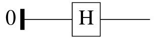

# Quipper

### Overview

Quipper is a quantum circuit description language. It is functional in nature, so when writing Quipper programs you can think in terms of gates being applied in real time to qubit variables, just as you would for a classical functional program. 

Quipper is implemented as a domain-specific language within the functional programming language [Haskell](https://www.haskell.org). Quipper was developed at Dalhousie University by Peter Selinger, and remains open source. Its original goal was to to accurately estimate and reduce the computational resources required to implement quantum algorithms on a realistic quantum computer. It comes with a standard library implementation of 7 nontrivial reference quantum algorithms; compiling them into quantum circuits tells you how many qubits are needed exactly.

This brief survey will roughly follow the article [An Introduction to Quantum Programming in Quipper](http://arxiv.org/abs/1304.5485). For much more information, see the [Quipper homepage](https://www.mathstat.dal.ca/~selinger/quipper/) and the official [Quipper documentation](https://www.mathstat.dal.ca/~selinger/quipper/doc/). 

#### Circuit model

Quipper can express circuits that allow both quantum and classical wires and operations in the same circuit. Quantum operations can be controlled by a classical wire, but not the other way around. An explicit measurement operation turns a quantum wire into a classical wire.

Quipper's circuit model also has scope: some (ancilla) wires are only used in part of a circuit, and may be explicitly initialised and terminated part-way the circuit.

There are three distinct phases of execution:

* **Compile time**: when Quipper syntax is translated into an executable classical program. 

* **Circuit generation time**: when the resulting classical program generated a quantum circuit. Inputs whose value is known at this stage are called **parameters**. For example, the Deutsch-Jozsa algorithm is really a family of circuits, one for each natural number `n`. 

* **Circuit execution time**: when the resulting quantum circuit is executed on (simulated) quantum hardware. Inputs whose value are only known at this stage are called **inputs**. For example, the inputs to Deutsch-Jozsa on `n` qubits are $n$ input qubits.

To keep the different kinds of input separate, Quipper uses three basic types for bits and qubits.

* **Bits**: have type `Bool` at circuit generation time, and have type `Bit` as a classical Boolean input to a circuit.

* **Qubits**: have type `Qubit` and are only available as inputs at circuit execution time.

`Bool` can be converted into `Bit`, but not the other way around. Because measurements can only occur at circuit execution time, their outcome is a `Bit`, not a `Bool`.

Quipper is **lazy**. That is, when it evaluates a circuit-producing function, that circuit is produced on the fly. That is useful for very large circuits, which therefore don't need to be stored in memory all at once. Circuits can also be consumed lazily.

#### Embedded language

Quipper is implemented as an embedded language within the host language Haskell, and the quipper compiler is really a wraparound for the Haskell compiler. Hence, Quipper really is a collection of data types, combinators, and functions within Haskell. However, not every Haskell program is a good Quipper program, and there is a preferred style of writing Quipper programs. If you don't adhere to that style, there is no guarantee that Quipper acts as expected. Because of this more or less mandated programming style, you can also think of Quipper as a language in its own right, without thinking about Haskell.

#### Primitive operations

Here is a very simple Quipper function:

    plus_minus :: Bool -> Circ Qubit
    plus_minus b = do
      q <- qinit b
      r <- hadamard q
      return r

The first line is the type of the function. You could in fact leave it out, and the Quipper compiler will infer it. But for now it's useful to see that the input to the function is a boolean parameter. The output type `Circ Qubit` says that the function results in a circuit that returns a single qubit. 
The body of the function uses three operations, that are evaluated in the given order. First, a variable `q` of type `Qubit` is initialised with value `b`. Here, `False` corresponds to $\ket{0}$ and `True` corresponds to $\ket{1}$. Then, a `hadamard` operator is applied to the qubit, resulting in a new qubit `r`. Finally, `r` is returned as the output of the whole function.

You could evaluate this function as follows:

    import Quipper
    main = print_simple PDF (plus_minus False)

To obtain the following circuit as a PDF file:

Apart from the built-in function `hadamard`, you also have `qnot` for the $X$ gate, and the infix operator `'controlled'`, that turns any operation into a controlled one. This code:

    share :: Qubit -> Circ (Qubit, Qubit)
    share a = do
      b <- qinit False
      b <- qnot b 'controlled' a
      return (a,b)

gives a 2-qubit circuit, where the second qubit is initialised $\ket{0}$, and a single CNOT gate is applied, that is, a circuit for the function $\alpha\ket{0}+\beta\ket{1} \mapsto \alpha\ket{00} + \beta\ket{11}$.

To **measure** a qubit, there is a function `measure`:

    measurement :: Qubit -> Circ Bit
    measurement q = do
      x <- measure q
      return x

If you no longer need a measurement result, or any other `Bit`, you can discard it:

    cdiscard x

### Deutsch-Jozsa

The Deutsch-Jozsa algorithm can now be written in Quipper as follows:

    deutschjozsa :: (Qubit -> Qubit -> Qubit -> Circ (Qubit, Qubit, Qubit)) 
                    -> Circ (Bit, Bit)
    deutschjozsa (oracle) = do
      x <- qinit False
      y <- qinit False
      z <- qinit True
      hadamard x
      hadamard y
      hadamard z
      (x,y,z) <- oracle x y z
      hadamard x
      hadamard y
      (a,b) <- measure (x,y)
      return (a,b)

Here, `oracle` is a function of type `Qubit -> Qubit -> Qubit -> Circ (Qubit, Qubit, Qubit)`; a circuit that turns 3 input qubits into 3 output qubits. Unlike in OpenQASM, we can feed the Quipper version of `deutschjozsa` any such function we like. It could be, as before:

    oracle x y z = do
      qnot_at z `controlled` [x, y]
      return (x,y,z)

But it could also be any other function `oracle` of the right type.

### Advanced mechanisms

Let us briefly touch on some of the more advanced mechanisms that Quipper offers.

#### Quantum data types

From the basic data types `Bit` and `Qubit`, you can build up more complicated data types, using tuples and lists. For example:

* `(Qubit,[Qubit])` is a type whose elements are pairs of a qubit and a list of qubits.

Every quantum data types has an associated classical data type, in this case `(Bit,[Bit])`, and an associated boolean data type, in this case `(Bool,[Bool])`.

#### Generic functions

The power of functional programming in Quipper comes to the fore with generic functions. We already saw `measure`, `cdiscard`, and `print_simple`. These are functions that can accept inputs of many different types. We won't go into detail here, but for an example, here is a generic version of the `plus_minus` function above:

    plus_minus_generic a = do
      qs <- qinit a
      qs <- mapUnitary hadamard qs
      return qs

This function does not just apply to `Bool`, but can also produce, for example, a circuit of type `(Qubit,[Qubit])` out of `(Bool,[Bool])`.

#### Recursion

In Quipper you can write circuit-producing functions that are recursive over any parameters known at circuit generation time. So, for example, you can recurse over a list of qubits. For a nice recursive implementation of the Quantum Fourier Transform, see [An Introduction to Quantum Programming in Quipper](http://arxiv.org/abs/1304.5485).

#### Circuit operations

You can also write functions that take a circuit, say of type `Circ [Qubit]`, and make new circuits based on it. For example, repeating a circuit a number of times, or reversing a circuit, or use a given circuit as a subcircuit in a larger circuit.

Finally, any classical reversible function can be turned into a circuit automatically by Quipper. Write a function such as

    reversiblefunction :: (Bool, Bool, Bool) -> (Bool, Bool, Bool)
    reversiblefunction x y z = y z x

and then turn it into a circuit by using the operation `build_circuit` just before:

    build_circuit
    reversiblefunction :: (Bool, Bool, Bool) -> (Bool, Bool, Bool)
    reversiblefunction x y z = y z x

#### Semantics

Quipper is one of few quantum programming languages with well-founded semantics. Haskell is well-studied academically, and many of its mathematical models extend to Quipper. For example, the crucial `Circ` construction is in fact a [monad](https://wiki.haskell.org/Monad). However, some aspects of Quipper that would be useful for a quantum programming language are not well reflected in Haskell:

* **Dependent types**: Haskell has no mechanism to recognise that a parameter of type `Bool` is available at circuit generation time, but a `Bit` is only used at circuit execution time.
* **Linear types**: qubits cannot be copied or deleted, but terms of any Haskell type can.

There is a family of descendants of Quipper, called [Proto-Quipper](https://arxiv.org/abs/2204.13041), that aim to make Quipper a standalone language and semantics to remedy these issues.

---

[Back](index.html)

